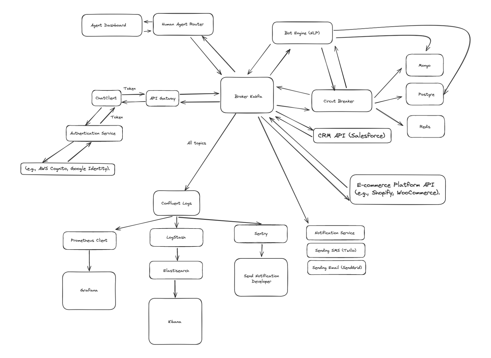

# AI-Enabled Bot Platform

## Overview

This README provides a detailed guide on implementing an AI-enabled bot platform for meaningful interactions between businesses and customers via Instant Messaging. The backend architecture, components, data flow, storage patterns, API design, and security considerations are covered to ensure a robust, scalable, and reliable system.

## Project Structure

```
.
├── main.go
├── handlers.go
├── kafka.go
├── mongodb.go
├── postgres.go
├── nlp.go
├── response.go
├── Dockerfile
└── README.md
```

## Dependencies

Ensure the following dependencies are added to `go.mod`:

```go
module example.com/messaging-system

go 1.18

require (
    github.com/gin-gonic/gin v1.7.7
    github.com/lib/pq v1.10.3
    github.com/segmentio/kafka-go v0.4.20
    go.mongodb.org/mongo-driver v1.7.3
    github.com/streadway/handy v0.0.0-20210601193511-3278e3eebf90
)
```

## Main Components

### Frontend Layer

- **Microfrontends (Single-SPA)**:
  - **Chat Client**: Interface for customer interactions.
  - **Admin Dashboard**: Interface for configuring workflows and viewing analytics.
  - **Agent Dashboard**: Interface for customer support agents.

### Backend Layer

- **API Gateway (Kong, NGINX)**: Manages routing, rate limiting, authentication, and logging.
- **Authentication Service (OAuth2, JWT)**: Manages user authentication and authorization.
- **Bot Engine**: Handles automated workflows, Q&A, and integrations with other services using NLP.
- **Human Agent Router**: Routes interactions to human agents when necessary.
- **Notification Service (Twilio, SendGrid)**: Sends notifications via various channels.
- **CRM Integration Service**: Integrates with existing CRM systems.
- **E-commerce Integration Service**: Handles e-commerce related actions.
- **Analytics Service (Prometheus, Grafana)**: Collects and analyzes data for insights.
- **Security Service**: Manages encryption, data privacy, and compliance.
- **Event Bus (Apache Kafka, NATS)**: Manages events for asynchronous communication.

### Storage Layer

- **Relational Database (PostgreSQL)**: Stores structured data.
- **NoSQL Database (MongoDB)**: Stores semi-structured data.
- **Blob Storage (AWS S3)**: Stores large files.
- **Cache (Redis)**: Stores frequently accessed data.

## Data Flow

### Initial Interaction

1. The user sends a message through the Chat Client.
2. The message is sent to the API Gateway.

### Message Processing

1. The API Gateway forwards the message to the Event Bus (Apache Kafka or NATS).
2. The Bot Engine consumes the event from the Event Bus.
3. The Bot Engine processes the message using NLP and determines the response.

### Message Routing

1. If human intervention is needed, the Bot Engine publishes an event to the Human Agent Router.
2. Otherwise, the Bot Engine prepares an automated response.

### User Response

1. The response, whether automated or human, is sent back to the user via the API Gateway.

### Notifications and Integrations

- The Notification Service may send additional notifications as needed.
- Integrations with CRM and e-commerce systems are performed through their respective integration services.

### Monitoring and Logging

- Prometheus collects metrics and Grafana visualizes them, setting up alerts as needed.
- The ELK Stack (Elasticsearch, Logstash, Kibana) centralizes logging and monitoring.
- Sentry tracks and alerts on errors.

### Data Storage

- Structured data is stored in PostgreSQL.
- Semi-structured data is stored in MongoDB.
- Large files are stored in AWS S3.
- Frequently accessed data is stored in Redis.

# Implementation

### main.go

```go
package main

import (
    "log"
    "github.com/gin-gonic/gin"
)

func main() {
    r := gin.Default()
    r.POST("/sendMessage", SendMessageHandler)
    go ConsumeEvents()
    log.Fatal(r.Run(":8080"))
}
```

### handlers.go

```go
package main

import (
    "net/http"
    "github.com/gin-gonic/gin"
    "github.com/streadway/handy/breaker"
    "github.com/streadway/handy/retry"
    "time"
)

var circuit = breaker.NewBreaker(3) // Circuit Breaker with a threshold of 3 failures

type MessageRequest struct {
    UserID  string `json:"userId"`
    Message string `json:"message"`
}

func SendMessageHandler(c *gin.Context) {
    var message MessageRequest
    if err := c.ShouldBindJSON(&message); err != nil {
        c.JSON(http.StatusBadRequest, gin.H{"error": err.Error()})
        return
    }

    // Use Circuit Breaker and Retry for the publishEvent operation
    err := circuit.Run(func() error {
        return retry.Retry(3, 2*time.Second, func() error {
            return publishEvent("messageReceived", message.UserID, message.Message)
        })
    })

    if err != nil {
        // Fallback response
        c.JSON(http.StatusInternalServerError, gin.H{"error": "Failed to process message", "fallback": "Please try again later"})
        return
    }

    c.JSON(http.StatusOK, gin.H{"status": "Message received"})
}
```

### kafka.go

```go
package main

import (
    "context"
    "log"
    "time"
    "github.com/segmentio/kafka-go"
    "github.com/streadway/handy/breaker"
    "github.com/streadway/handy/retry"
)

var kafkaWriter *kafka.Writer
var kafkaReader *kafka.Reader
var circuit = breaker.NewBreaker(3) // Circuit Breaker with a threshold of 3 failures

func init() {
    kafkaWriter = &kafka.Writer{
        Addr:     kafka.TCP("localhost:9092"),
        Topic:    "messages",
        Balancer: &kafka.LeastBytes{},
    }

    kafkaReader = kafka.NewReader(kafka.ReaderConfig{
        Brokers: []string{"localhost:9092"},
        Topic:   "messages",
        GroupID: "message-group",
    })
}

func publishEvent(eventType, userID, message string) error {
    msg := kafka.Message{
        Key:   []byte(eventType),
        Value: []byte(userID + ":" + message),
    }

    err := circuit.Run(func() error {
        return retry.Retry(3, 2*time.Second, func() error {
            return kafkaWriter.WriteMessages(context.Background(), msg)
        })
    })

    if err != nil {
        log.Printf("Failed to write message: %v", err)
        return err
    }
    return nil
}

func ConsumeEvents() {
    for {
        m, err := kafkaReader.ReadMessage(context.Background())
        if err != nil {
            log.Printf("Failed to read message: %v", err)
            continue
        }
        log.Printf("Message received: %s", string(m.Value))
        processMessage(string(m.Value))
    }
}

func processMessage(message string) {
    userID := extractUserID(message)
    messageContent := extractMessageContent(message)
    response := processNLP(messageContent)
    if requiresHumanIntervention(response) {
        publishEvent("humanInterventionRequired", userID, messageContent)
    } else {
        err := circuit.Run(func() error {
            return retry.Retry(3, 2*time.Second, func() error {
                if err := saveMessageToDB(userID, messageContent, response); err != nil {
                    log.Printf("Failed to save message: %v", err)
                    return err
                }
                return sendResponse(userID, response)
            })
        })
        if err != nil {
            log.Printf("Failed to process message: %v", err)
        }
    }
}

func extractUserID(message string) string {
    return "userID"
}

func extractMessageContent(message string) string {
    return "messageContent"
}
```

### mongodb.go

```go
package main

import (
    "context"
    "log"
    "time"
    "go.mongodb.org/mongo-driver/bson"
    "go.mongodb.org/mongo-driver/mongo"
    "go.mongodb.org/mongo-driver/mongo/options"
    "github.com/streadway/handy/breaker"
    "github.com/streadway/handy/retry"
)

var mongoClient *mongo.Client
var mongoCircuit = breaker.NewBreaker(3) // Circuit Breaker with a threshold of 3 failures

func init() {
    clientOptions := options.Client().ApplyURI("mongodb://localhost:27017")
    client, err := mongo.Connect(context.Background(), clientOptions)
    if err != nil {
        log.Fatal(err)
    }
    mongoClient = client
}

func saveToMongoDB(userID, message, response string) error {
    collection := mongoClient.Database("chat_logs").Collection("messages")
    err := mongoCircuit.Run(func() error {
        return retry.Retry(3, 2*time.Second, func() error {
            _, err := collection.InsertOne(context.TODO(), bson.D{
                {Key: "userId", Value: userID},
                {Key: "message", Value: message},
                {Key: "response", Value: response},
                {Key: "timestamp", Value: time.Now()},
            })
            return err
        })
    })

    if err != nil {
        log.Printf("Failed to save to MongoDB: %v", err)
        return err
    }
    return nil
}
```

### postgres.go

```go
package main

import (
    "database/sql"
    "log"
    _ "github.com/lib/pq"
    "github.com/streadway/handy/breaker"
    "github.com/streadway/handy/retry"
)

var db *sql.DB
var pgCircuit = breaker.NewBreaker(3) // Circuit Breaker with a threshold of 3 failures

func init() {
    var err error
    connStr = "user=yourusername dbname=yourdbname sslmode=disable"
    db, err = sql.Open("postgres", connStr)
    if err != nil {
        log.Fatal(err)
    }
}

func saveToPostgres(userID, message, response string) error {
    query = `INSERT INTO messages (user_id, message, response) VALUES ($1, $2, $3)`
    err := pgCircuit.Run(func() error {
        return retry.Retry(3, 2*time.Second, func() error {
            _, err = db.Exec(query, userID, message, response)
            return err
        })
    })

    if err != nil {
        log.Printf("Failed to save to PostgreSQL: %v", err)
        return err
    }
    return nil
}
```

### nlp.go

```go
package main

func processNLP(message string) string {
    // NLP processing code
    return "Thank you for contacting us. Your order details are..."
}

func requiresHumanIntervention(response string) bool {
    // Logic to determine if human intervention is needed
    return false // For simplicity, assuming no intervention needed
}
```

### response.go

```go
package main

import (
    "log"
    "net/http"
    "bytes"
    "encoding/json"
    "github.com/streadway/handy/breaker"
    "github.com/streadway/handy/retry"
    "time"
)

var responseCircuit = breaker.NewBreaker(3) // Circuit Breaker with a threshold of 3 failures

func sendResponse(userID, response string) error {
    payload := map[string]string{
        "userId": userID,
        "response": response,
    }
    payloadBytes, err := json.Marshal(payload)
    if err != nil {
        log.Printf("Failed to marshal response payload: %v", err)
        return err
    }

    err = responseCircuit.Run(func() error {
        return retry.Retry(3, 2*time.Second, func() error {
            _, err := http.Post("http://localhost:8080/api/sendResponse", "application/json", bytes.NewBuffer(payloadBytes))
            return err
        })
    })

    if err != nil {
        log.Printf("Failed to send response: %v", err)
        return err
    }
    return nil
}
```

## Dockerfile

```dockerfile
# Stage 1: Build the Go binary
FROM golang:1.18 as builder
WORKDIR /app
COPY . .
RUN go build -o messaging-system .

# Stage 2: Create the final image
FROM debian:bullseye-slim
WORKDIR /app
COPY --from=builder /app/messaging-system .
EXPOSE 8080
CMD ["./messaging-system"]
```

## Running the Application

1. Ensure MongoDB, PostgreSQL, and Kafka are running.
2. Build and run the application:

```bash
docker build -t messaging-system .
docker run -p 8080:8080 messaging-system
```

## Privacy and Security Considerations

- **Encryption**: All data at rest and in transit should be encrypted using industry-standard algorithms.
- **Authentication and Authorization**: Use OAuth2 and JWT for secure authentication and authorization.
- **Compliance**: Ensure the system complies with relevant regulations (e.g., GDPR, CCPA).

## Scalability and Reliability Considerations

- **Microservices Architecture**: Allows independent deployment of services.
- **Load Balancers**: Efficiently distribute network traffic.
- **Circuit Breakers**: Prevent failures in one service from affecting the entire system.
- **Auto-scaling**: Automatically adjust resource allocation as needed.
- **Redundancy Mechanisms**: Ensure no single points of failure (SPOF).
- **Database Replication**: Replicate data for high availability.
- **Automatic Failover**: Automatically switch services to healthy instances in case of failures.

## Metrics for Success

- **Response Time**: Measure the time taken to respond to user queries.
- **Error Rate**: Monitor the rate of errors occurring in the system.
- **Throughput**: Track the number of messages processed per second.
- **Uptime**: Ensure high availability of the system.

# Detailed System Execution Flow

### Execution Flow with Errors

1. **Initial Interaction**
    - **User**: Sends a message through the **Chat Client** (user interface).
    - **Chat Client**: Sends the message to the **API Gateway** via an HTTP POST request to the `/sendMessage` endpoint.

2. **Message Reception**
    - **API Gateway (Kong, NGINX)**: Receives the HTTP request.
    - **Availability Check**: The API Gateway checks if the **Event Bus (Kafka)** is available.
        - **Kafka Failure**:
            - **Retry**: The API Gateway attempts to resend the message for a defined number of retries.
            - **Circuit Breaker**: If Kafka remains unavailable, the Circuit Breaker is activated to temporarily prevent further attempts.
            - **Fallback**: The message is temporarily stored in **Redis** until Kafka becomes available again.
            - **Alert**: An alert is sent to the operations team via **Sentry** and **Prometheus** logs the failure.
    - **Event Bus (Kafka)**: If available, enqueues the message in the "messages" topic.

3. **Message Processing**
    - **Bot Engine**:
        - **Consumes the message** from the "messages" topic in Kafka.
        - **NLP Processing**: Analyzes the message using Natural Language Processing (NLP) to determine the appropriate response.
        - **Decision**: Determines if the response can be automated or if it needs to be routed to a human agent.
        - **Availability Check**: Before saving the response or routing to a human agent, the Bot Engine checks the availability of databases and notification services.
            - **MongoDB Failure**:
                - **Retry**: The Bot Engine attempts to save the message and response to MongoDB for a defined number of retries.
                - **Circuit Breaker**: If MongoDB remains unavailable, the Circuit Breaker is activated.
                - **Fallback**: The message is saved to **PostgreSQL** as a temporary alternative.
                - **Alert**: An alert is sent to the operations team via **Sentry**.
            - **PostgreSQL Failure**:
                - **Retry**: The Bot Engine attempts to save the metadata to PostgreSQL for a defined number of retries.
                - **Circuit Breaker**: If PostgreSQL remains unavailable, the Circuit Breaker is activated.
                - **Fallback**: The message and metadata are temporarily stored in **Redis**.
                - **Alert**: An alert is sent to the operations team via **Sentry**.

4. **Routing to Human Agent (if needed)**
    - **Human Agent Router**:
        - **Consumes the event** from Kafka indicating the need for human intervention.
        - **Sends the message** to the **Agent Dashboard** (customer support interface).
        - **Communication Failure**:
            - **Retry**: Attempts to resend the message to the Agent Dashboard.
            - **Circuit Breaker**: If communication fails continuously, the Circuit Breaker is activated.
            - **Alert**: An alert is sent via **Sentry**.

5. **Response to User**
    - **Bot Engine**:
        - **Publishes the response** to Kafka to be consumed by the **API Gateway**.
        - **Failure to Publish**:
            - **Retry**: Attempts to publish the response again.
            - **Circuit Breaker**: If continuous failures occur, the Circuit Breaker is activated.
            - **Fallback**: The response is stored in **Redis**.
    - **API Gateway**:
        - **Receives the response** from Kafka.
        - **Sends the response** back to the **Chat Client** via an HTTP request.
        - **Failure to Send**:
            - **Retry**: Attempts to resend the response.
            - **Circuit Breaker**: If the failure persists, the Circuit Breaker is activated.
            - **Alert**: An alert is sent via **Sentry**.

6. **Notifications and Integrations**
    - **Notification Service (Twilio, SendGrid)**:
        - **Notification Sending Failure**:
            - **Retry**: Attempts to resend the notification.
            - **Circuit Breaker**: If continuous failures occur, the Circuit Breaker is activated.
            - **Fallback**: The notification is stored for later sending.
    - **CRM Integration Service**:
        - **CRM Update Failure**:
            - **Retry**: Attempts to resend data to the CRM.
            - **Circuit Breaker**: If continuous failures occur, the Circuit Breaker is activated.
            - **Fallback**: Data is stored for later update.
    - **E-commerce Integration Service**:
        - **E-commerce Action Failure**:
            - **Retry**: Attempts to perform the action again.
            - **Circuit Breaker**: If continuous failures occur, the Circuit Breaker is activated.
            - **Fallback**: The action is stored for later execution.

7. **Monitoring and Logging**
    - **Prometheus**:
        - **Collects metrics** in real-time on system performance (latency, error rate, etc.).
        - **Sends metrics** to **Grafana** for visualization and alert configuration.
    - **ELK Stack (Elasticsearch, Logstash, Kibana)**:
        - **Logstash**: Receives logs from services.
        - **Elasticsearch**: Stores logs for querying.
        - **Kibana**: Allows visualization and analysis of logs.
    - **Sentry**:
        - **Monitors errors** and exceptions in the system.
        - **Sends alerts** to developers.

8. **Data Storage**
    - **PostgreSQL**:
        - **Stores structured data** such as interaction metadata and transactions.
    - **MongoDB**:
        - **Stores semi-structured data** such as message histories and activity logs.
    - **AWS S3**:
        - **Stores large files** and binaries associated with interactions.
    - **Redis**:
        - **Stores frequently accessed data** to improve system performance.

### Ensuring High Availability

- **Microservices Architecture**: Allows independent development and deployment of services.
- **Auto-scaling with Kubernetes**: Ensures the system automatically adjusts to varying loads by scaling resources up or down as needed.
- **Circuit Breakers and Retries**: Prevent catastrophic failures and enable automatic recovery from temporary faults.
- **Load Balancers**: Efficiently distribute network traffic among multiple service instances.
- **Fallback Mechanisms**: Use Redis and other temporary storage solutions to ensure operations can be completed later when the system recovers.
- **Database Replication and Sharding**: Ensure high availability and scalability of data.
- **Monitoring and Alerting**: Use Prometheus, Grafana, and Sentry for real-time system monitoring and quick alerting for intervention.

This flow covers common failures and recovery mechanisms, providing a clear view of how the system maintains high availability and resilience even under adverse conditions.

### Happy Path Execution Flow

1. **Initial Interaction**
    - **User**: Sends a message through the **Chat Client** (user interface).
    - **Chat Client**: Sends the message to the **API Gateway** via an HTTP POST request to the `/sendMessage` endpoint.

2. **Message Reception**
    - **API Gateway (Kong, NGINX)**: Receives the HTTP request and forwards it to the **Bot Engine** service via the **Event Bus** (Kafka).
    - **Event Bus (Kafka)**: Enqueues the message in the "messages" topic.

3. **Message Processing**
    - **Bot Engine**:
        - **Consumes the message** from the "messages" topic in Kafka.
        - **NLP Processing**: Analyzes the message using Natural Language Processing (NLP) to determine the appropriate response.
        - **Decision**: Determines if the response can be automated or if it needs to be routed to a human agent.
        - If it's an automated response:
            - **Prepares the automated response**.
            - **Saves the message and response** in the NoSQL database (MongoDB) for history.
            - **Saves metadata** in the relational database (PostgreSQL) for future structured queries.
        - If human intervention is needed:
            - **Publishes an event** to Kafka indicating human intervention is required.

4. **Routing to Human Agent (if needed)**
    - **Human Agent Router**:
        - **Consumes the event** from Kafka indicating the need for human intervention.
        - **Sends the message** to the **Agent Dashboard** (customer support interface).

5. **Response to User**
    - **Bot Engine**:
        - **Publishes the response** to Kafka to be consumed by the **API Gateway**.
    - **API Gateway**:
        - **Receives the response** from Kafka.
        - **Sends the response** back to the **Chat Client** via an HTTP request.

6. **Notifications and Integrations**
    - **Notification Service (Twilio, SendGrid)**:
        - If necessary, **sends notifications** via SMS or email.
    - **CRM Integration Service**:
        - **Updates the CRM** with information about the user's interaction.
    - **E-commerce Integration Service**:
        - **Performs e-commerce-related actions**, such as updating order status, if applicable.

7. **Monitoring and Logging**
    - **Prometheus**:
        - **Collects metrics** in real-time on system performance (latency, error rate, etc.).
        - **Sends metrics** to **Grafana** for visualization and alert configuration.
    - **ELK Stack (Elasticsearch, Logstash, Kibana)**:
        - **Logstash**: Receives logs from services.
        - **Elasticsearch**: Stores logs for querying.
        - **Kibana**: Allows visualization and analysis of logs.
    - **Sentry**:
        - **Monitors errors** and exceptions in the system.
        - **Sends alerts** to developers.

8. **Data Storage**
    - **PostgreSQL**:
        - **Stores structured data** such as interaction metadata and transactions.
    - **MongoDB**:
        - **Stores semi-structured data** such as message histories and activity logs.
    - **AWS S3**:
        - **Stores large files** and binaries associated with interactions.
    - **Redis**:
        - **Stores frequently accessed data** to improve system performance.

# Practical Example of Sending and Reading a Message

## 1. Client Sends a Message

**Client** sends a message via **Chat Client**.
- **Endpoint**: POST `/sendMessage`
- **Payload**:
    ```json
    {
      "userId": "12345",
      "message": "Hello, I need help with my order."
    }
    ```

**API Gateway** receives the request and forwards it to the **Event Bus**.
- **Endpoint (API Gateway)**: POST `/api/sendMessage`
- **Endpoint (Event Bus)**: POST `/event/messageReceived`
- **Payload**:
    ```json
    {
      "eventType": "messageReceived",
      "data": {
        "userId": "12345",
        "message": "Hello, I need help with my order."
      }
    }
    ```

**Event Bus (Apache Kafka)** processes the event and sends it to the **Bot Engine**.

## 2. Message Processing by Bot Engine

**Bot Engine** consumes the event from the **Event Bus** and processes the message using NLP.
- **Kafka Consumer Function**:
    ```go
    func consumeMessage(event Event) {
        userId := event.data["userId"]
        message := event.data["message"]
        response := processNLP(message)
        if requiresHumanIntervention(response) {
            publishEvent("humanInterventionRequired", userId, message)
        } else {
            saveMessageToDB(userId, message, response)
            sendResponse(userId, response)
        }
    }
    ```

**Check for Human Intervention**:
- **Function**:
    ```go
    func requiresHumanIntervention(response string) bool {
        // Logic to determine if human intervention is needed
        return false // For simplicity, assuming no intervention needed
    }
    ```

**Save the Message in Databases**:
- **SQL Database (PostgreSQL)**: Stores structured messages and metadata.
    ```sql
    INSERT INTO messages (user_id, message, response) VALUES ($1, $2, $3)
    ```

- **NoSQL Database (MongoDB)**: Stores semi-structured logs and additional information.
    ```go
    collection := client.Database("chat_logs").Collection("messages")
    _, err := collection.InsertOne(context.TODO(), bson.D{
        {Key: "userId", Value: userId},
        {Key: "message", Value: message},
        {Key: "response", Value: response},
        {Key: "timestamp", Value: time.Now()},
    })
    ```

**Send the Response to the Client**:
- **Endpoint**: POST `/api/sendResponse`
- **Payload**:
    ```json
    {
      "userId": "12345",
      "response": "Thank you for contacting us. Your order details are..."
    }
    ```

- **Function**:
    ```go
    func sendResponse(userId string, response string) {
        // Send response to the client via the API Gateway
    }
    ```

## 3. Integration with Notifications and CRM

**Notification Service** sends additional notifications if necessary.
- **Endpoint**: POST `/api/notify`
- **Payload**:
    ```json
    {
      "userId": "12345",
      "notification": "Your order has been shipped."
    }
    ```

**CRM Integration Service** updates information in the CRM system.
- **Endpoint**: POST `/api/updateCRM`
- **Payload**:
    ```json
    {
      "userId": "12345",
      "message": "Customer inquired about order status."
    }
    ```

## 4. Monitoring and Logging

**Prometheus** collects metrics and **Grafana** visualizes them.
**ELK Stack** centralizes logs.
- **Example Log (Elasticsearch)**:
    ```json
    {
      "timestamp": "2023-06-01T12:34:56Z",
      "userId": "12345",
      "message": "Hello, I need help with my order.",
      "response": "Thank you for contacting us. Your order details are...",
      "status": "success"
    }
    ```

## 5. Scalability and Fault Tolerance

- **Load Balancers (NGINX, HAProxy)** distribute traffic.
- **Kubernetes** manages auto-scaling.
- **Circuit Breakers** prevent failures from propagating.
- **Backup and Recovery** are automated.
- **Replication and Cross-region Replication** ensure high availability.

## Handling Errors

### 1. Error in Sending Message

If the **Event Bus** or **Bot Engine** is down, the **API Gateway** retries the request.
- **Retry Logic**:
    ```go
    err := retry.Do(
        func() error {
            return publishEvent("messageReceived", userId, message)
        },
        retry.Attempts(3),
        retry.DelayType(retry.FixedDelay),
        retry.Delay(2*time.Second),
    )
    if err != nil {
        log.Printf("Failed to publish event: %v", err)
    }
    ```

### 2. Error in Processing Message

If the **Bot Engine** cannot process the message, it logs the error and sends an alert via **Sentry**.
- **Error Handling in Bot Engine**:
    ```go
    func processMessage(message string) {
        defer func() {
            if r := recover(); r != nil {
                log.Printf("Recovered from error: %v", r)
                sentry.CaptureException(fmt.Errorf("processMessage panic: %v", r))
            }
        }()
        // Process message logic
    }
    ```

### 3. Database Errors

If there's a failure in saving data to **PostgreSQL** or **MongoDB**, the **Bot Engine** uses a circuit breaker to prevent further calls and retries after some delay.
- **Circuit Breaker and Retry for Database Operations**:
    ```go
    err := circuitBreaker.Run(func() error {
        return retry.Do(
            func() error {
                return saveToPostgres(userId, message, response)
            },
            retry.Attempts(3),
            retry.DelayType(retry.FixedDelay),
            retry.Delay(2*time.Second),
        )
    })
    if err != nil {
        log.Printf("Circuit breaker open: %v", err)
    }
    ```

### 4. Network Issues

If there are network issues, the system falls back to a default response and logs the incident.
- **Fallback Response**:
    ```go
    func sendResponse(userId string, response string) {
        err := retry.Do(
            func() error {
                return postResponse(userId, response)
            },
            retry.Attempts(3),
            retry.DelayType(retry.FixedDelay),
            retry.Delay(2*time.Second),
        )
        if err != nil {
            log.Printf("Failed to send response: %v", err)
            sendFallbackResponse(userId)
        }
    }

    func sendFallbackResponse(userId string) {
        // Send a generic fallback response
    }
    ```

# Practical Example of Sending and Reading a Message with AWS and GCP

## AWS Solution

### 1. Client Sends a Message

**Client** sends a message via **Chat Client**.
- **Endpoint**: POST `/sendMessage`
- **Payload**:
    ```json
    {
      "userId": "12345",
      "message": "Hello, I need help with my order."
    }
    ```

**API Gateway** receives the request and forwards it to the **Event Bus**.
- **Endpoint (API Gateway)**: POST `/api/sendMessage`
- **Endpoint (Event Bus)**: POST `/event/messageReceived`
- **Payload**:
    ```json
    {
      "eventType": "messageReceived",
      "data": {
        "userId": "12345",
        "message": "Hello, I need help with my order."
      }
    }
    ```

**Event Bus (Amazon SNS/SQS)** processes the event and sends it to the **Bot Engine**.

### 2. Message Processing by Bot Engine

**Bot Engine** consumes the event from the **Event Bus** and processes the message using NLP.
- **SNS/SQS Consumer Function**:
    ```go
    func consumeMessage(event Event) {
        userId := event.data["userId"]
        message := event.data["message"]
        response := processNLP(message)
        if requiresHumanIntervention(response) {
            publishEvent("humanInterventionRequired", userId, message)
        } else {
            saveMessageToDB(userId, message, response)
            sendResponse(userId, response)
        }
    }
    ```

**Check for Human Intervention**:
- **Function**:
    ```go
    func requiresHumanIntervention(response string) bool {
        // Logic to determine if human intervention is needed
        return false // For simplicity, assuming no intervention needed
    }
    ```

**Save the Message in Databases**:
- **SQL Database (Amazon RDS for PostgreSQL)**: Stores structured messages and metadata.
    ```sql
    INSERT INTO messages (user_id, message, response) VALUES ($1, $2, $3)
    ```

- **NoSQL Database (Amazon DynamoDB)**: Stores semi-structured logs and additional information.
    ```go
    svc := dynamodb.New(session.New())
    item := map[string]*dynamodb.AttributeValue{
        "userId": {
            S: aws.String(userId),
        },
        "message": {
            S: aws.String(message),
        },
        "response": {
            S: aws.String(response),
        },
        "timestamp": {
            S: aws.String(time.Now().Format(time.RFC3339)),
        },
    }
    _, err := svc.PutItem(&dynamodb.PutItemInput{
        TableName: aws.String("ChatLogs"),
        Item:      item,
    })
    ```

**Send the Response to the Client**:
- **Endpoint**: POST `/api/sendResponse`
- **Payload**:
    ```json
    {
      "userId": "12345",
      "response": "Thank you for contacting us. Your order details are..."
    }
    ```

- **Function**:
    ```go
    func sendResponse(userId string, response string) {
        // Send response to the client via the API Gateway
    }
    ```

### 3. Integration with Notifications and CRM

**Notification Service (Amazon SNS)** sends additional notifications if necessary.
- **Endpoint**: POST `/api/notify`
- **Payload**:
    ```json
    {
      "userId": "12345",
      "notification": "Your order has been shipped."
    }
    ```

**CRM Integration Service** updates information in the CRM system.
- **Endpoint**: POST `/api/updateCRM`
- **Payload**:
    ```json
    {
      "userId": "12345",
      "message": "Customer inquired about order status."
    }
    ```

### 4. Monitoring and Logging with Datadog

**Datadog** collects metrics and visualizes them.
- **Log Example (Datadog)**:
    ```json
    {
      "timestamp": "2023-06-01T12:34:56Z",
      "userId": "12345",
      "message": "Hello, I need help with my order.",
      "response": "Thank you for contacting us. Your order details are...",
      "status": "success"
    }
    ```

### 5. Scalability and Fault Tolerance

- **Load Balancers (AWS Elastic Load Balancing)** distribute traffic.
- **Amazon ECS/EKS** manages auto-scaling.
- **AWS Circuit Breakers (AWS Step Functions)** prevent failures from propagating.
- **Backup and Recovery (AWS Backup)** are automated.
- **Replication and Cross-region Replication (AWS Aurora, DynamoDB Global Tables)** ensure high availability.

## GCP Solution

### 1. Client Sends a Message

**Client** sends a message via **Chat Client**.
- **Endpoint**: POST `/sendMessage`
- **Payload**:
    ```json
    {
      "userId": "12345",
      "message": "Hello, I need help with my order."
    }
    ```

**API Gateway** receives the request and forwards it to the **Event Bus**.
- **Endpoint (API Gateway)**: POST `/api/sendMessage`
- **Endpoint (Event Bus)**: POST `/event/messageReceived`
- **Payload**:
    ```json
    {
      "eventType": "messageReceived",
      "data": {
        "userId": "12345",
        "message": "Hello, I need help with my order."
      }
    }
    ```

**Event Bus (Google Pub/Sub)** processes the event and sends it to the **Bot Engine**.

### 2. Message Processing by Bot Engine

**Bot Engine** consumes the event from the **Event Bus** and processes the message using NLP.
- **Pub/Sub Consumer Function**:
    ```go
    func consumeMessage(ctx context.Context, msg *pubsub.Message) {
        var event Event
        json.Unmarshal(msg.Data, &event)
        userId := event.data["userId"]
        message := event.data["message"]
        response := processNLP(message)
        if requiresHumanIntervention(response) {
            publishEvent("humanInterventionRequired", userId, message)
        } else {
            saveMessageToDB(userId, message, response)
            sendResponse(userId, response)
        }
        msg.Ack()
    }
    ```

**Check for Human Intervention**:
- **Function**:
    ```go
    func requiresHumanIntervention(response string) bool {
        // Logic to determine if human intervention is needed
        return false // For simplicity, assuming no intervention needed
    }
    ```

**Save the Message in Databases**:
- **SQL Database (Google Cloud SQL for PostgreSQL)**: Stores structured messages and metadata.
    ```sql
    INSERT INTO messages (user_id, message, response) VALUES ($1, $2, $3)
    ```

- **NoSQL Database (Google Cloud Firestore)**: Stores semi-structured logs and additional information.
    ```go
    client, err := firestore.NewClient(ctx, projectID)
    if err != nil {
        log.Fatalf("Failed to create Firestore client: %v", err)
    }
    _, _, err = client.Collection("ChatLogs").Add(ctx, map[string]interface{}{
        "userId":    userId,
        "message":   message,
        "response":  response,
        "timestamp": time.Now(),
    })
    if err != nil {
        log.Fatalf("Failed adding to Firestore: %v", err)
    }
    ```

**Send the Response to the Client**:
- **Endpoint**: POST `/api/sendResponse`
- **Payload**:
    ```json
    {
      "userId": "12345",
      "response": "Thank you for contacting us. Your order details are..."
    }
    ```

- **Function**:
    ```go
    func sendResponse(userId string, response string) {
        // Send response to the client via the API Gateway
    }
    ```

### 3. Integration with Notifications and CRM

**Notification Service (Google Cloud Pub/Sub)** sends additional notifications if necessary.
- **Endpoint**: POST `/api/notify`
- **Payload**:
    ```json
    {
      "userId": "12345",
      "notification": "Your order has been shipped."
    }
    ```

**CRM Integration Service** updates information in the CRM system.
- **Endpoint**: POST `/api/updateCRM`
- **Payload**:
    ```json
    {
      "userId": "12345",
      "message": "Customer inquired about order status."
    }
    ```

### 4. Monitoring and Logging with Google Cloud Operations (formerly Stackdriver)

**Google Cloud Operations** collects metrics and visualizes them.
- **Log Example (Google Cloud Logging)**:
    ```json
    {
      "timestamp": "2023-06-01T12:34:56Z",
      "userId": "12345",
      "message": "Hello, I need help with my order.",
      "response": "Thank you for contacting us. Your order details are...",
      "status": "success"
    }
    ```

### 5. Scalability and Fault Tolerance

- **Load Balancers (Google Cloud Load Balancing)** distribute traffic.
- **Google Kubernetes Engine (GKE)** manages auto-scaling.
- **Google Cloud Functions** prevent failures from propagating.
- **Backup and Recovery (Google Cloud Backup)** are automated.
- **Replication and Cross-region Replication (Google Cloud Spanner, Firestore)** ensure high availability.

